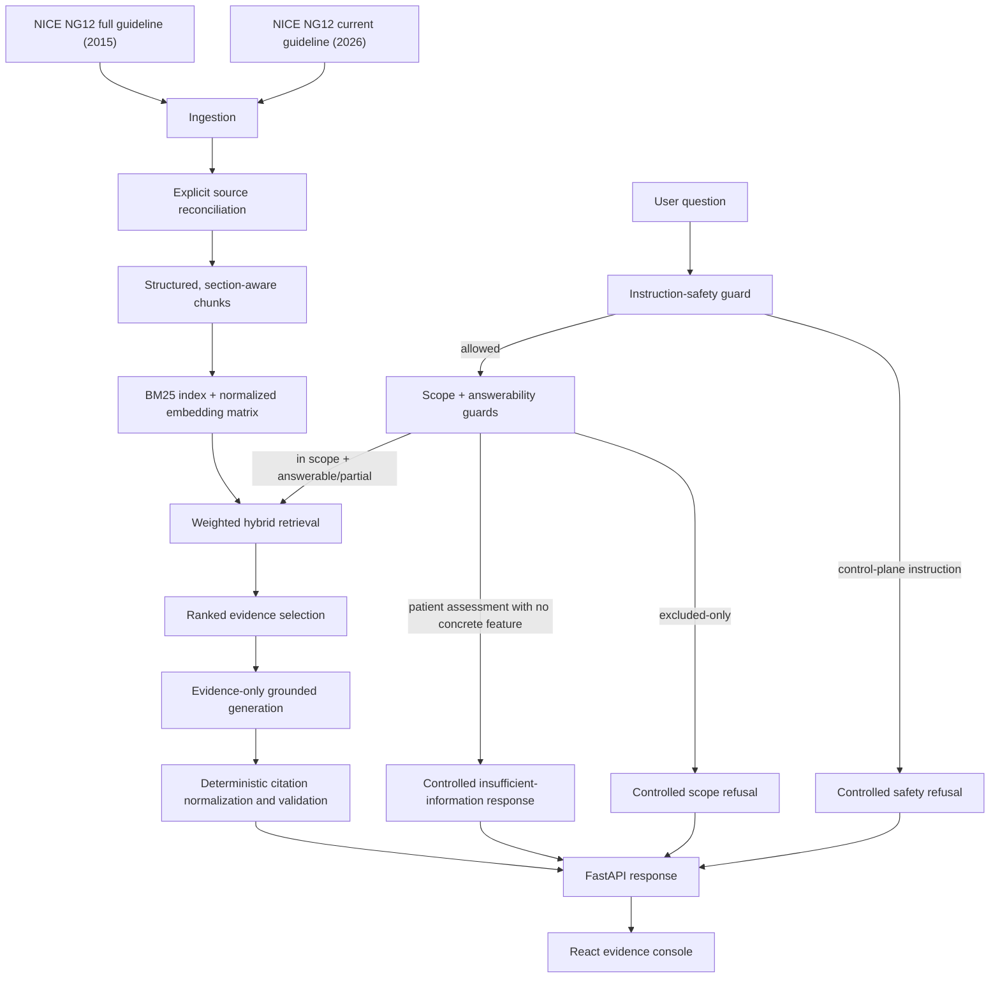
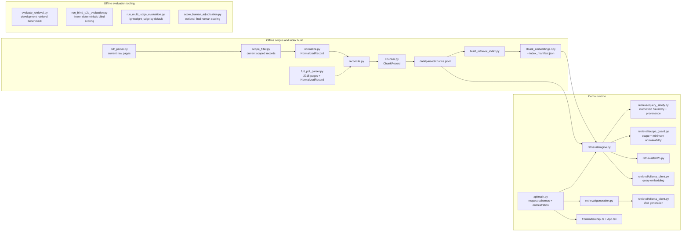

# NG12 RAG Architecture

This document describes the implementation after the August 2026 architecture audit. It is intentionally narrower than a production clinical system: it is a hackathon evidence-retrieval demo over seven configured NG12 cancer sites, not a diagnostic or patient-care service.

## Level 1: system flow

The authority rule is enforced before generation: current 2026 recommendations are canonical; historical 2015 recommendation copies are retained for audit but never chunked. Other 2015 evidence, rationale, and methodology may be retrieved as supporting context.

## Level 2: modules and artifacts

There is no separate application-service module. `api/main.py` is the composition root and performs the short orchestration sequence directly. At this project size that is simpler than introducing a service framework, although request/response dictionaries create a few implicit contracts.

## Offline data flow

1. `scripts/build_corpus.py` validates and copies both PDFs to stable source names.
2. `src/ingestion/pdf_parser.py` uses PyMuPDF for all 101 physical current-guideline pages. `cleaner.py` removes layout furniture without clinical rewriting.
3. `src/ingestion/scope_filter.py` separately selects recommendation boundaries, table rows, shared guidance, and definitions. pdfplumber is used only for the current PDF's ruled symptom tables.
4. `src/ingestion/normalize.py` maps current `ScopedRecord` objects into the shared `NormalizedRecord` schema.
5. `src/ingestion/full_pdf_parser.py` independently parses all 382 historical full-guideline pages and emits supporting `NormalizedRecord` objects using bookmark, position, font, and table-title structure.
6. `src/ingestion/reconcile.py` links historical records to current recommendations. It does not merge their clinical wording. Historical recommendation records have `retrieval_eligible=false`.
7. `src/ingestion/chunker.py` preserves each current clinical unit intact. It splits only oversized supporting records along source structure, sentence, or extracted line boundaries.
8. `scripts/build_retrieval_index.py` embeds the exact retrieval text for all 440 chunks and writes a normalized NumPy matrix plus a manifest containing the chunk-file hash and embedding model.

Primary artifacts are:

| Artifact | Role | State introduced |
|---|---|---|
| `pages_current.jsonl`, `pages_full.jsonl` | Physical-page audit trail | Cleaned text plus physical page/source identity |
| `records_clean.jsonl` | Reconciled pre-chunk corpus | Authority, content type, canonical/retrieval eligibility, links |
| `chunks.jsonl` | Runtime retrieval corpus | Stable `chunk_id`, chunk index/count, token count |
| `chunk_embeddings.npy` | Dense retrieval signal | Row-ordered normalized vectors |
| `index_manifest.json` | Index/corpus contract | Chunk hash, model, dimensions, row count |
| `merge_report.json` | Build diagnostics | Counts, conflicts, duplicates, chunk distributions |

## Runtime request flow

For the concrete question, “Should a 45-year-old with visible haematuria be referred for suspected renal cancer?”:

1. `AnswerRequest` in `api/main.py` validates the string, mode, evidence count, and optional filters.
2. `RetrievalEngine.search()` trims whitespace, clamps top-k, and calls `assess_query_safety()` before any clinical classification. Explicit attempts to override instructions, bypass evidence, fabricate provenance, change source authority, or extract secrets return `outcome=safety_refusal` with no embedding, retrieval, or model call.
3. Allowed queries continue to `assess_emergency()` before scope. Explicit current major bleeding, breathing emergencies, loss of consciousness, or acute chest pain return `outcome=emergency_redirect` before embedding, retrieval, or generation. Clear queries then continue to `assess_scope()` and `assess_query_answerability()`. The scope guard returns `status=in_scope`, `selected_sites=["renal"]`, and no excluded sites. The answerability guard sees the concrete haematuria feature, so the query continues.
4. `BM25Index.scores()` computes lexical scores over retrieval text containing section, subsection, recommendation ID, sites, content type, and source text. Query-only filtering removes the measured non-clinical scaffold terms `what`, `about`, and `the`; document tokens and all other query terms are unchanged.
5. `OllamaClient.embed()` creates a normalized query vector using `search_query:` prefixing. Exact matrix multiplication produces cosine scores against 440 vectors.
6. The engine max-normalizes allowed BM25 scores, maps dense cosine scores from `[-1,1]` into `[0,1]`, and calculates `0.55 × BM25 + 0.45 × dense`.
7. Explicit, named deterministic adjustments are applied. In the observed trace, current recommendation 1.6.6 received `+0.22` for canonical authority and `+0.03` for the explicit renal-site match. Its base score was `0.807042`; final score was `1.057042`.
8. The sorted result is copied from the chunk dictionary and augmented with `rank`, `score`, `score_detail`, and a human-readable provenance citation. Rank 1 was `ng12_1.6.6_c01`, current 2026, page 23.
9. `/api/answer` passes the first six ranked results to `generate_grounded_answer()`. Evidence labels `[E1]` through `[E6]` are assigned from this list before the prompt is created.
10. The prompt marks each block with its evidence label, full citation, authority, content type, and verbatim chunk text. The model is instructed to use only those blocks.
11. `normalize_citation_labels()` canonicalizes observed formatting variants. `validate_citation_labels()` verifies every label is within range and every visible prose sentence, bullet, or table data row carries at least one label. If only claim coverage fails, one bounded evidence-constrained repair is allowed, then the complete validator runs again. This proves coverage and label binding, not semantic entailment.
12. FastAPI returns an explicit outcome, the generated answer, citation-validation result, complete retrieval response, warnings, latency, model, and safety note. Invalid or incompletely cited output is withheld with `outcome=generation_rejected`. The React UI renders guard outcomes separately; a citation appears as `E# · p.#` and opens page, section, subsection, recommendation, version, authority, chunk identity, full passage, and ranking trace.

## Runtime schemas and contracts

| Stage | Representation | Important contract |
|---|---|---|
| Raw current page | `PageRecord` dataclass | One object per physical page; cleaned text is not summarized |
| Current scoped unit | `ScopedRecord` dataclass | Recommendation/table/term boundaries and source fields retained |
| Reconciled source unit | `NormalizedRecord` dataclass | One authority vocabulary: `2026_current/primary` or `2015_full/supporting` |
| Retrieval unit | `ChunkRecord` dataclass, serialized JSONL | Stable identity and sufficient page/source/version provenance |
| Search result | Runtime dictionary derived from chunk | Chunk fields plus rank and score detail; implicit internal contract |
| Evidence block | Ordered search-result dictionary | Evidence ID is `E{rank}` for this response only; `chunk_id` is persistent |
| Generated answer | Runtime dictionary | Answer, model, timings, warnings, deterministic citation result |
| Public API | Pydantic request models, inferred dictionary responses | Input typed; output shape is shared implicitly with TypeScript interfaces |
| Evaluation case | Versioned JSONL dictionaries | `case_id` joins questions, hidden gold, run, diagnostics, and packets |

`E1` is intentionally request-local. The stable provenance identity is `chunk_id`; the UI must not persist an evidence rank independently of its response.

## State and initialization

- Corpus and embedding state are loaded once into the process-global `RetrievalEngine` when `api.main` imports. BM25 statistics and the NumPy matrix are immutable after construction.
- Engine startup fails loudly for a missing chunk corpus, a stale chunk hash, a mismatched embedding model/shape, or non-finite/non-normalized vectors.
- `RuntimeTelemetry` is the only mutable runtime state. It is a bounded, in-process demo counter/latency sample and is neither durable nor thread/process aggregated.
- Ollama clients create an `httpx.AsyncClient` per call. At hackathon load this favors simplicity over connection-pool optimization.
- Evaluation artifacts are offline files and are not part of the answering path. `/api/metrics` only reads them for display.

## Safety and authority invariants

1. Excluded-only site phrases are refused before embedding, retrieval, or generation.
2. Explicit control-plane instructions are normalized for Unicode/invisible formatting and refused before scope, embedding, retrieval, or generation. The rule targets instruction hierarchy, provenance, authority manipulation, and secret extraction; it is not a general semantic classifier.
3. In a mixed query, excluded phrases are removed before in-scope phrase detection, preventing “gall bladder” from also becoming “bladder.”
4. A patient-specific decision or severity/uncertainty assessment containing no concrete clinical feature returns a controlled insufficient-information response before retrieval or generation. Site names, age/duration qualifiers, and generic words such as “issues” are not treated as symptoms. The gate detects missing input shape; it does not encode eligibility criteria.
5. Partially specified questions continue to evidence-grounded generation, where absent patient attributes remain unknown and recommendation modality plus AND/OR structure must be preserved.
6. A model response without at least one valid in-range evidence label, or with any fabricated label, is withheld instead of being displayed beside unrelated retrieval results.
5. Historical recommendation text is never present in `chunks.jsonl`.
6. Supporting 2015 evidence can retrieve, but its metadata and prompt label remain `supporting`.
7. Retrieval decides which evidence is supplied; generation cannot request additional corpus content.
8. Generation may still overreach or cite a topically related passage. Citation syntax validation is not entailment validation; semantic evaluation remains offline.
9. Insufficient information, unsupported/no-result, and out-of-scope are separate states: the first two guards return controlled 200 responses without a model call, while a filtered empty retrieval becomes 404.

## Relevant failure behavior

| Failure | Behavior |
|---|---|
| Current/full PDF missing during build | Fail loudly with the exact path |
| Chunk corpus missing at API startup | Fail startup; demo is not falsely “ready” |
| Dense index missing | Dense/hybrid requests explicitly fall back to BM25 with `mode_used=bm25` and a warning |
| Dense index stale/corrupt/model-mismatched | Fail startup loudly; never combine unrelated rows/vectors |
| Query embedding or Ollama generation unavailable | API returns controlled 503 |
| Metadata filters match no chunks | Search returns empty results plus warning; answer returns 404 |
| Excluded-only question | Fail closed before expensive work; controlled refusal |
| Patient-specific assessment with no concrete clinical feature | Fail closed before retrieval/model; request specific symptoms without making a decision |
| Malformed/empty model answer | Returned with failed citation validation and warning; no fabricated fallback answer |
| Invalid evidence label | Preserved in answer, reported as invalid; validation fails |
| Metrics artifact absent | Optional evaluation fields are null; required merge report absence currently produces server error |

## Deployment shape

The deployable demo is one FastAPI process, one React static build, local corpus/index files, and one reachable Ollama endpoint. There is deliberately no vector database, reranker, agent framework, queue, worker, cache server, container platform, or orchestration layer. Exact NumPy cosine over 440 vectors is simpler, fully inspectable, and measured fast enough for the project.
